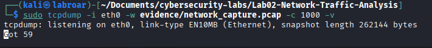

# Suspicious Traffic Analysis with Multi-System Correlation

## Project Overview
This project analyzes anomalous network traffic detected by Splunk, correlates events with existing tickets in ServiceNow, and generates a comprehensive incident report that demonstrates forensic analysis and data correlation skills.

-**Duration**: 

2 hours
Difficulty: Entry Level
Platform: Kali Linux


**Tools Used**

- **Kali Linux**: Network traffic generation
- **Splunk**: Traffic analysis and anomaly detection
- **ServiceNow**: Incident management system
- **tcpdump**: Packet capture
- **Wireshark**: Packet analysis (optional)

**Objective**

Detect and analyze suspicious network traffic, correlate events between Splunk and ServiceNow tickets, and document the complete incident with remediation recommendations.

 **Lab Environment**

- Kali Linux VM
- Splunk (your current subscription)
- ServiceNow Developer Instance
- Local network connection

**Prerequisites**

- tcpdump installed (sudo apt install tcpdump)
- sudo permissions on Kali Linux
- ServiceNow account configured
- Basic networking knowledge

## PHASE 1: PREPARING THE ENVIRONMENT

   - **Step 1.1: Check the system**


```which tcpdump``` Verify that tcpdump is installed.

   - **Step 1.2**

```ip a``` Verify the network interface

> [!NOTE] 
> Write down the name of your interface; we will use it in the next step.

   - **Step 1.3: Create laboratory structure**


```bash 
cd ~/Documents
mkdir -p cybersecurity-labs/Lab02-Network-Traffic-Analysis
cd cybersecurity-labs/Lab02-Network-Traffic-Analysis
mkdir screenshots evidence queries
ls -l
```


## PHASE 2: TRAFFIC CAPTURE

   - **Step 2.1: Start packet capture**

```bash
sudo tcpdump -i eth0 -w evidence/network_capture.pcap -c 1000 -v
```

 Detailed Explanation of Each Parameter in `tcpdump`

| Parameter | Meaning | Why / Notes |
|-----------|---------|-------------|
| `sudo` | `tcpdump` requires raw access to the network interface, which only root can provide. | Root privileges are necessary to capture packets directly from the interface. |
| `-i eth0` | Specifies WHICH interface to listen on. | Not all interfaces are chosen because it would generate too much noise. |
| `-w evidence/network_capture.pcap` | SAVES the captured packets into a file. | **Why `.pcap`?** It is the standard format understood by all analysis tools.<br>**Why `evidence/`?** For organization and to simulate a real case scenario. |
| `-c 1000` | Captures ONLY 1000 packets and then stops. | **Why 1000?** It balances having enough data without filling the disk.<br>**Alternative:** `-G 60` would capture for 60 seconds (not recommended here). |
| `-v` | Verbose mode (shows details on screen while capturing). | Useful for monitoring packet details in real time. |




   - **Step 2.2: Generate controlled “suspicious” traffic**

While tcpdump is capturing, open another terminal:

```bash
for port in 21 22 23 25 80 443 3389 445; do
  echo "Testing port $port..."
  timeout 2 nc -zv 8.8.8.8 $port 2>&1 | tee -a evidence/scan_output.txt
  sleep 1
done
```

**COMPLETE breakdown**

**Line 1**: ```for port in 21 22 23 25 80 443 3389 445; do```

- ***What does it do?*** Loop that iterates over each port number
- ***Why these ports?***
  - 21: FTP (File Transfer Protocol) - file transfer
  - 22: SSH (Secure Shell) - remote access
  - 23: Telnet - obsolete and insecure protocol
  - 25: SMTP (email)
  - 80: HTTP (unencrypted web)
  - 443: HTTPS (encrypted web)
  - 3389: RDP (Remote Desktop Protocol) - Windows
  - 445: SMB (Server Message Block) - Windows file sharing

These are the ports that an attacker scans first, reconnaissance

**Line 2** ```echo “Testing port $port...”```
- Displays which port is being tested

- ***Why?*** Visual feedback to confirm that the script is working

**Line 3** ```timeout 2 nc -zv 8.8.8.8 $port 2>&1 | tee -a evidence/scan_output.txt```

***Let's break it down***

- ```timeout 2``` : Kills the command if it takes more than 2 seconds
  - ***Why?*** Some closed ports can hang the connection
- ```nc``` netcat, the “Swiss Army knife” of networking
- ```-z``` Zero I/O mode (only checks, does not send data)
  - ***Why?*** Faster and less intrusive
- ```-v``` Verbose (shows results)
- ```8.8.8.8``` Google's public DNS
  - ***Why Google?*** It's safe for testing, we're not violating any policies
  - ***Rejected alternative*** `scanme.nmap.org` (designed for this, but slower)
- ```$port``` The current loop port
- ```2>&1``` Redirects errors (stderr) to normal output (stdout)
  - ***Why?*** netcat prints results to stderr, we want to capture them
- ```| tee -a evidence/scan_output.txt```
  - ***What does `tee` do?*** It displays ON SCREEN AND saves to file simultaneously
  - ```-a``` Append (add to the end, do not overwrite)


